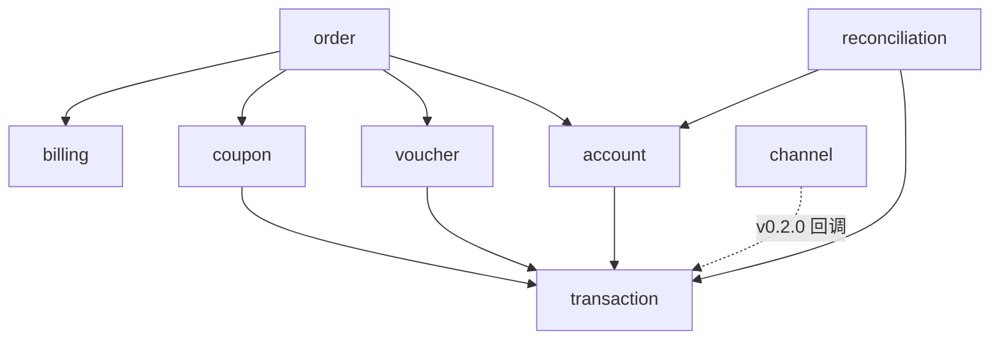

# 服务端 v0.1.0 模块划分

依据[服务端 v0.1.0 路线图](../../../../data/roadmap/provider.md)与[领域模型](../../../../data/insight/model.md)划分，落地于 `src/provider` Go 模块：在现有 `channel` 渠道模块旁新增账本核心各模块，`cmd/server` 统一组装。

## 模块总览

| 模块 | 包 | 职责 | 里程碑 |
|------|-----|------|--------|
| 账户与余额 | `internal/account` | 账户（客户虚拟钱包）、余额；充值登记、余额查询 | M1 |
| 交易账本 | `internal/transaction` | 不可变交易记录（充值/消费/发券/核销）；**账本写入唯一入口** | M1 |
| 优惠券 | `internal/coupon` | 折扣券/满减券；发放、过期流转、结算时核销 | M2 |
| 代金券 | `internal/voucher` | 面值抵现券；发放、过期流转、结算时抵现 | M2 |
| 订单与结算 | `internal/order` | 订单生命周期；结算入口（单事务协调） | M3 |
| 计费规则 | `internal/billing` | 抵扣顺序配置与抵扣计算（纯计算，无存储依赖） | M3 |
| 对账与可查 | `internal/reconciliation` | 一致性校验、对公打款核对、账单导出 | M4 |
| 支付渠道 | `internal/channel` | 微信 JSAPI / 支付宝网页支付（现有，保持独立） | M5 |
| 中间件 | `internal/middleware` | 请求日志（现有） | — |

账本核心 = `account` + `transaction`（对应路线图中的 `ledger`）。`channel` 是后接的可替换渠道层，v0.2.0 接入时作为交易来源，**模型不变，变的只是交易来源**。

## 依赖关系



- `transaction` 是最底层模块，被所有写账本的模块依赖
- `billing` 是纯计算模块（给定订单金额与可用券/余额，输出抵扣明细），不依赖任何存储
- `order` 依赖最多，是结算的编排者：应用计费规则 → 写消费/核销交易 → 更新余额与券状态
- `channel` 目前不依赖账本模块，v0.2.0 接入时只新增「回调 → 自动入账」适配

## 关键设计约束

1. **账本写入唯一入口**：所有账本变更（充值/发券/消费/核销）必须经 `transaction` 模块写入，配合幂等键与唯一约束，保证不丢、不重、可查
2. **同事务更新**：余额、券状态与交易在同一数据库事务内更新（不错）；各模块 repository 共享同一 `*gorm.DB` 连接，跨模块写（结算）由 `order` 服务在单个事务内协调
3. **金额整数分**：全链路整数分存储，不做浮点金额
4. **渠道独立演进**：`channel` 不依赖账本模块，账本跑通前不扩展渠道能力
5. **存储双引擎**：开发环境 SQLite、生产环境 PostgreSQL，由 GORM（类似 SQLAlchemy 的 ORM）统一调度——repository 只写一套 GORM 实现，方言（sqlite/postgres）由 `cmd/server` 按配置（`DB_DRIVER` / `DATABASE_URL`）在启动时选择；迁移用 GORM AutoMigrate，生产环境后续引入版本化迁移

## 目录结构

```
src/provider/
├── cmd/
│   └── server/
│       └── main.go              ← 组装依赖，启动服务
├── internal/
│   ├── account/                 ← 账户与余额
│   │   ├── transport.go         ← HTTP handler（参数绑定、协议转换）
│   │   ├── service.go           ← 业务逻辑接口 + 实现
│   │   ├── repository.go        ← 存储接口定义
│   │   ├── model.go             ← 领域模型、DTO
│   │   ├── service_test.go      ← 单元测试（mock repository）
│   │   └── gorm/                ← repository 的 GORM 实现（SQLite/PostgreSQL 方言切换）
│   │       └── account_repo.go
│   ├── transaction/             ← 交易账本（结构同 account）
│   │   ├── service.go
│   │   ├── repository.go
│   │   ├── model.go
│   │   └── gorm/
│   ├── coupon/                  ← 优惠券（结构同 account）
│   │   ├── transport.go
│   │   ├── service.go
│   │   ├── repository.go
│   │   ├── model.go
│   │   └── gorm/
│   ├── voucher/                 ← 代金券（结构同 account）
│   │   ├── transport.go
│   │   ├── service.go
│   │   ├── repository.go
│   │   ├── model.go
│   │   └── gorm/
│   ├── order/                   ← 订单与结算（结构同 account）
│   │   ├── transport.go
│   │   ├── service.go
│   │   ├── repository.go
│   │   ├── model.go
│   │   └── gorm/
│   ├── billing/                 ← 计费规则
│   │   ├── service.go           ← 抵扣计算（纯逻辑）
│   │   ├── repository.go
│   │   ├── model.go
│   │   └── gorm/
│   ├── reconciliation/          ← 对账与可查
│   │   ├── transport.go
│   │   ├── service.go
│   │   └── model.go
│   ├── channel/                 ← 支付渠道（现有）
│   │   ├── transport.go
│   │   ├── service.go
│   │   ├── adapters.go
│   │   ├── model.go
│   │   ├── wechat/              ← 微信 JSAPI 渠道
│   │   └── alipay/              ← 支付宝网页支付渠道
│   └── middleware/              ← 请求日志（现有）
│       └── logging.go
├── pkg/                         ← 预留：公共库（金额分、幂等键生成）
├── docs/                        ← 模块划分等设计文档
├── go.mod
├── go.sum
└── Makefile
```

## 各模块职责

### account 账户与余额（M1）

- 模型：Account（客户虚拟钱包）、Balance（交易投影）
- 职责：创建账户；充值登记（对公打款入账，带幂等键）；余额查询
- 依赖：`transaction`（充值 → 写入充值交易，余额与交易同事务）
- API：`POST /accounts`、`POST /accounts/{id}/recharges`、`GET /accounts/{id}`

### transaction 交易账本（M1）

- 模型：Transaction（充值/消费/发券/核销，不可变记录）
- 职责：账本写入唯一入口（幂等键 + 唯一约束，不重）；流水查询（可查）
- 依赖：无（最底层）
- API：`GET /accounts/{id}/transactions`（路由沿用账户资源，由本模块服务实现）

### coupon 优惠券（M2）

- 模型：Coupon（折扣券 `rate` / 满减券 `threshold`+`amount`；`scope`、`expiresAt`、`status`）
- 职责：发放（幂等，生成发券交易）；过期流转（已发放 → 已过期）；核销由结算触发
- 依赖：`transaction`
- API：`POST /accounts/{id}/coupons`、`GET /accounts/{id}/coupons`

### voucher 代金券（M2）

- 模型：Voucher（固定面值 `amount`；`scope`、`expiresAt`、`status`）
- 职责：发放（幂等，生成发券交易）；过期流转；抵现由结算触发
- 依赖：`transaction`
- API：`POST /accounts/{id}/vouchers`、`GET /accounts/{id}/vouchers`

### order 订单与结算（M3）

- 模型：Order（客户购买付费服务的交易请求）
- 职责：下单并结算——调用 `billing` 确定抵扣 → 写消费/核销交易 → 更新余额与券状态，全程单事务
- 依赖：`billing`、`coupon`、`voucher`、`account`、`transaction`
- API：`POST /orders`（下单并结算）、`GET /orders/{id}`（订单与结算明细）

### billing 计费规则（M3）

- 模型：BillingRule（`priority` / `condition`）
- 职责：默认抵扣顺序「优惠券 → 代金券 → 余额」的配置与抵扣计算；顺序由 `priority` 配置，不改代码可调
- 依赖：无（纯计算；给定订单金额与可用券/余额，输出逐项抵扣明细）
- API：无独立端点，供 `order` 结算调用

### reconciliation 对账与可查（M4）

- 职责：一致性校验（余额 = 交易按方向求和）；对公打款核对（充值登记 vs 银行流水 CSV）；账单导出
- 依赖：`account`、`transaction`
- API：`GET /accounts/{id}/statement`

### channel 支付渠道（现有，M5）

- 微信 JSAPI（公众号/小程序）、支付宝网页支付（PC）；下单/查询/退款/通知解析
- v0.2.0：支付回调（`ParseNotify` / `VerifyNotify`）→ 自动写入充值交易，替代手动登记
- 保持独立，v0.1.0 不做扩展，接入时逐步生产验证

## 与里程碑的对应

| 里程碑 | 交付模块 |
|--------|----------|
| M1 账户与账本 | `account` + `transaction` |
| M2 优惠券与代金券 | `coupon` + `voucher` |
| M3 订单与计费规则 | `order` + `billing` |
| M4 对账与可查 | `reconciliation` |
| M5 支付渠道对接（v0.2.0） | `channel`（现有）→ `transaction` 自动入账 |
