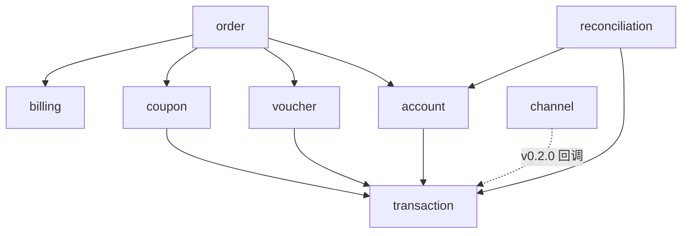

# 服务端 v0.1.0 文档

量潮支付服务端 v0.1.0（账本核心）的设计文档集。落地于 `src/provider` Go 模块：在现有 `channel` 渠道模块旁新增账本核心各模块，`cmd/server` 统一组装。

## 文档导航

| 文档 | 内容 | 里程碑 |
|------|------|--------|
| [conventions](conventions.md) 设计约束与实现约定 | 关键设计约束、存储/事务/幂等/金额约定 | — |
| [account](account.md) 账户与余额 | 充值登记、余额查询 | M1 |
| [transaction](transaction.md) 交易账本 | 账本写入唯一入口、流水查询 | M1 |
| [coupon](coupon.md) 优惠券 | 发放、过期流转、核销 | M2 |
| [voucher](voucher.md) 代金券 | 发放、过期流转、抵现 | M2 |
| [billing](billing.md) 计费规则 | 抵扣顺序与计算 | M3 |
| [order](order.md) 订单与结算 | 下单与结算编排 | M3 |
| [reconciliation](reconciliation.md) 对账与可查 | 一致性校验、对公核对、账单 | M4 |
| [channel](channel.md) 支付渠道 | 微信/支付宝（现有） | M5 |

## 模块总览

| 模块 | 包 | 职责 | 里程碑 |
|------|-----|------|--------|
| 账户与余额 | `internal/account` | 账户（客户虚拟钱包）、余额；充值登记、余额查询 | M1 |
| 交易账本 | `internal/transaction` | 不可变交易记录（充值/消费/发券/核销）；**账本写入唯一入口** | M1 |
| 优惠券 | `internal/coupon` | 折扣券/满减券；发放、过期流转、结算时核销 | M2 |
| 代金券 | `internal/voucher` | 面值抵现券；发放、过期流转、结算时抵现；计价规则集快照管理 | M2 |
| 订单与结算 | `internal/order` | 订单生命周期；结算入口（单事务协调） | M3 |
| 计费规则 | `internal/billing` | 抵扣顺序配置与抵扣计算（纯计算，无存储依赖） | M3 |
| 对账与可查 | `internal/reconciliation` | 一致性校验、对公打款核对、账单导出 | M4 |
| 支付渠道 | `internal/channel` | 微信 JSAPI / 支付宝网页支付（现有，保持独立） | M5 |
| 中间件 | `internal/middleware` | 请求日志（现有） | — |

账本核心 = `account` + `transaction`（对应路线图中的 `ledger`）。`channel` 是后接的可替换渠道层，v0.2.0 接入时作为交易来源，**模型不变，变的只是交易来源**。

## 依赖关系



- `transaction` 是最底层模块，被所有写账本的模块依赖
- `billing` 是纯计算模块（给定订单金额与可用券/余额，输出抵扣明细），不依赖任何存储
- `order` 依赖最多，是结算的编排者：应用计费规则 → 写消费/核销交易 → 更新余额与券状态
- `channel` 目前不依赖账本模块，v0.2.0 接入时只新增「回调 → 自动入账」适配

## 目录结构

```
src/provider/
├── cmd/
│   └── server/
│       └── main.go              ← 组装依赖，启动服务
├── internal/
│   ├── account/                 ← 账户与余额
│   │   ├── transport.go         ← HTTP handler（参数绑定、协议转换）
│   │   ├── service.go           ← 业务逻辑接口 + 实现
│   │   ├── repository.go        ← 存储接口定义
│   │   ├── model.go             ← 领域模型、DTO
│   │   ├── service_test.go      ← 单元测试（mock repository）
│   │   └── gorm/                ← repository 的 GORM 实现（SQLite/PostgreSQL 方言切换）
│   │       └── account_repo.go
│   ├── transaction/             ← 交易账本（结构同 account）
│   │   ├── service.go
│   │   ├── repository.go
│   │   ├── model.go
│   │   └── gorm/
│   ├── coupon/                  ← 优惠券（结构同 account）
│   │   ├── transport.go
│   │   ├── service.go
│   │   ├── repository.go
│   │   ├── model.go
│   │   └── gorm/
│   ├── voucher/                 ← 代金券（结构同 account）
│   │   ├── transport.go
│   │   ├── service.go
│   │   ├── repository.go
│   │   ├── model.go
│   │   └── gorm/
│   ├── order/                   ← 订单与结算（结构同 account）
│   │   ├── transport.go
│   │   ├── service.go
│   │   ├── repository.go
│   │   ├── model.go
│   │   └── gorm/
│   ├── billing/                 ← 计费规则
│   │   ├── service.go           ← 抵扣计算（纯逻辑）
│   │   ├── repository.go
│   │   ├── model.go
│   │   └── gorm/
│   ├── reconciliation/          ← 对账与可查
│   │   ├── transport.go
│   │   ├── service.go
│   │   └── model.go
│   ├── channel/                 ← 支付渠道（现有）
│   │   ├── transport.go
│   │   ├── service.go
│   │   ├── adapters.go
│   │   ├── model.go
│   │   ├── wechat/              ← 微信 JSAPI 渠道
│   │   └── alipay/              ← 支付宝网页支付渠道
│   └── middleware/              ← 请求日志（现有）
│       └── logging.go
├── pkg/                         ← 预留：公共库（金额分、幂等键生成）
├── docs/                        ← 设计文档（本目录）
├── go.mod
├── go.sum
└── Makefile
```

## 与里程碑的对应

| 里程碑 | 交付模块 |
|--------|----------|
| M1 账户与账本 | `account` + `transaction` |
| M2 优惠券与代金券 | `coupon` + `voucher` |
| M3 订单与计费规则 | `order` + `billing` |
| M4 对账与可查 | `reconciliation` |
| M5 支付渠道对接（v0.2.0） | `channel`（现有）→ `transaction` 自动入账 |

## 扩展新功能

新增功能 = 新增模块：

1. 在 `internal/` 下创建模块目录（transport/service/repository/model + gorm/）
2. 编写 `docs/<module>.md`，登记到「文档导航」与「模块总览」表
3. 按依赖关系图接线——账本写入一律经 `transaction` 模块
