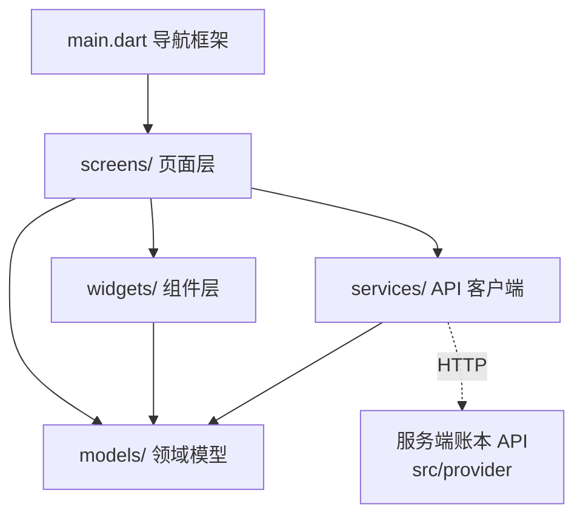

# 客户端 v0.1.0 文档

量潮支付工作台客户端（`qtcloud_pay_studio`，Flutter 桌面应用）的设计文档集。落地于 `src/studio`：管理人员工作台 GUI，把服务端账本 API 的操作包装成页面——客户端只做展示与表单，不承载账务逻辑（结算、幂等、状态机全在服务端）。

## 文档导航

| 文档 | 内容 | 里程碑 |
|------|------|--------|
| [conventions](conventions.md) 设计约束与实现约定 | 与服务端契约一致（JSON/枚举/金额/时间）、联调约定、错误映射 | — |
| [account](account.md) 账户与余额 | 账户列表/详情、充值登记 | M1 |
| [transaction](transaction.md) 交易账本 | 流水展示、带符号金额 | M1 |
| [coupon](coupon.md) 优惠券 | 折扣券/满减券发放与查询 | M2 |
| [voucher](voucher.md) 代金券 | 面值券发放与查询 | M2 |
| [billing](billing.md) 计费规则 | 抵扣顺序展示、结算明细模型 | M3 |
| [order](order.md) 订单与结算 | 下单、结算明细 | M3 |
| [reconciliation](reconciliation.md) 对账与可查 | 一致性校验、对公核对、账单 | M4 |
| [dashboard](dashboard.md) 总览 | 里程碑状态、待办、快捷入口 | M1 起 |

## 相关文档

| 文档 | 位置 | 内容 |
|------|------|------|
| 服务端设计文档 | [src/provider/docs/index.md](../../provider/docs/index.md) | 账本 API 模块划分（联调契约的事实源） |
| 工作台设计 | [data/roadmap/studio.md](../../../../../data/roadmap/studio.md) | 页面与组件需求来源（§六 Flutter 客户端） |

## 模块总览

| 层 | 模块 | 目录/文件 | 职责 | 里程碑 |
|----|------|-----------|------|--------|
| 应用层 | 入口与导航 | `lib/main.dart` | 应用入口、左侧导航框架、路由 | — |
| 页面层 | 总览页 | `lib/screens/dashboard_screen.dart` | 里程碑状态、今日待办、快捷入口 | M1 起 |
| 页面层 | 账户页 | `lib/screens/accounts_screen.dart` | 账户列表、创建账户 | M1 |
| 页面层 | 账户详情页 | `lib/screens/account_detail_screen.dart` | 余额、交易流水、券列表 | M1 |
| 页面层 | 充值登记页 | `lib/screens/recharge_screen.dart` | 对公打款入账表单 | M1 |
| 页面层 | 发券页 | `lib/screens/coupon_screen.dart` | 优惠券/代金券发放与查询 | M2 |
| 页面层 | 订单结算页 | `lib/screens/order_screen.dart` | 下单、结算明细 | M3 |
| 页面层 | 参数配置页 | `lib/screens/settings_screen.dart` | 抵扣顺序、券模板、变更登记 | M3 |
| 页面层 | 对账页 | `lib/screens/reconcile_screen.dart` | 余额校验、CSV 比对 | M4 |
| 组件层 | 复用组件 | `lib/widgets/` | 金额/状态/表单/列表等通用组件（见各模块文档） | 各里程碑 |
| 模型层 | 领域模型 | `lib/models/` | Account / Transaction / Coupon / Voucher / Order / BillingRule | 各里程碑 |
| 服务层 | API 客户端 | `lib/services/pay_api.dart` | 封装全部账本端点、错误映射 | 各里程碑 |

每个页面 = 「表单/展示 + 调 API + 结果反馈」，数据模型与服务端 JSON 契约一致（见 [conventions](conventions.md)），联调以服务端为准。

## 依赖关系



- `widgets/` 是纯展示层，不调 API；状态与数据经 `services/` 流入
- `models/` 是最底层，被页面、组件、服务共同依赖
- 页面不直接拼 URL，统一走 `services/pay_api.dart`（端点变更只改一处）

## 目录结构

```
src/studio/
├── lib/
│   ├── main.dart                  ← 应用入口 + 左侧导航框架
│   ├── screens/                   ← 页面层
│   │   ├── dashboard_screen.dart
│   │   ├── accounts_screen.dart
│   │   ├── account_detail_screen.dart
│   │   ├── recharge_screen.dart
│   │   ├── coupon_screen.dart
│   │   ├── order_screen.dart
│   │   ├── reconcile_screen.dart
│   │   └── settings_screen.dart
│   ├── widgets/                   ← 组件层（复用）
│   │   ├── money_text.dart
│   │   ├── status_chip.dart
│   │   ├── account_picker.dart
│   │   ├── idempotency_field.dart
│   │   ├── amount_field.dart
│   │   ├── transaction_list.dart
│   │   ├── settle_detail_panel.dart
│   │   ├── reconcile_diff_table.dart
│   │   └── milestone_card.dart
│   ├── models/                    ← 领域模型（与服务端 JSON 契约一致）
│   │   ├── account.dart
│   │   ├── transaction.dart
│   │   ├── coupon.dart
│   │   ├── voucher.dart
│   │   ├── order.dart
│   │   └── billing_rule.dart
│   └── services/
│       └── pay_api.dart           ← API 客户端
├── doc/                           ← 设计文档（本目录）
├── test/                          ← 组件/页面 widget 测试
├── pubspec.yaml
└── README.md
```

## 与里程碑的对应

| 里程碑 | 客户端交付 |
|--------|-----------|
| M1 账户与账本 | 账户页 + 账户详情页 + 充值登记页（[account](account.md) + [transaction](transaction.md)） |
| M2 优惠券与代金券 | 发券页（[coupon](coupon.md) + [voucher](voucher.md)） |
| M3 订单与计费规则 | 订单结算页 + 参数配置页（[order](order.md) + [billing](billing.md)） |
| M4 对账与可查 | 对账页（[reconciliation](reconciliation.md)） |
| M5 支付通道对接（v0.2.0） | 页面基本不变：充值/订单页由「登记/结算」转为查看自动入账结果 |

## 扩展新功能

新增页面 = `screens/` 加文件 → `main.dart` 注册导航 → 复用 `widgets/` → `services/pay_api.dart` 加端点方法 → 编写对应模块文档（登记到「文档导航」与「模块总览」）→ `test/` 加 widget 测试。

新增组件 = `widgets/` 加文件（纯展示，不调 API），登记到对应模块文档的组件清单。

新增模型 = `models/` 加文件，与服务端模型 JSON 契约一一对应；金额统一整数分，展示经 `MoneyText`。
