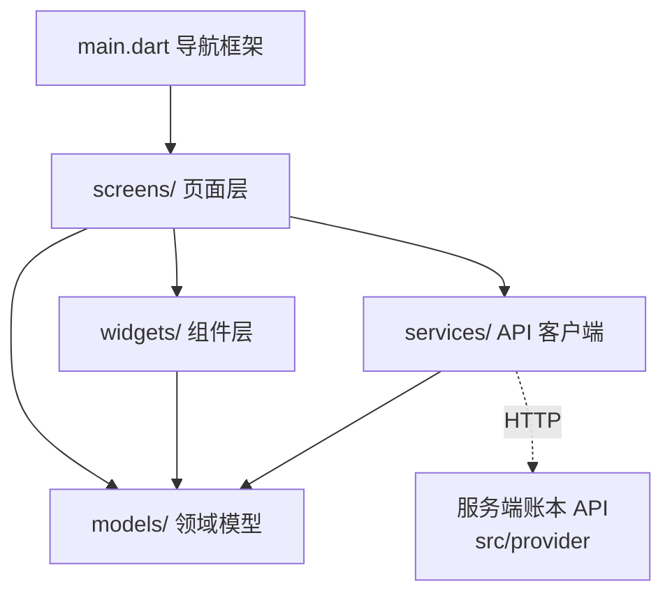

# 客户端 v0.1.0 文档

量潮支付工作台客户端（`qtcloud_pay_studio`，Flutter 桌面应用）的模块划分设计。落地于 `src/studio`：管理人员工作台 GUI，把服务端账本 API 的操作包装成页面——客户端只做展示与表单，不承载账务逻辑（结算、幂等、状态机全在服务端）。

## 相关文档

| 文档 | 位置 | 内容 |
|------|------|------|
| 服务端设计文档 | [src/provider/docs/index.md](../../provider/docs/index.md) | 账本 API 模块划分（本客户端对接） |
| 工作台设计 | [data/roadmap/studio.md](../../../../../data/roadmap/studio.md) | 页面与组件需求来源（§六 Flutter 客户端） |

## 模块总览

| 层 | 模块 | 目录/文件 | 职责 | 里程碑 |
|----|------|-----------|------|--------|
| 应用层 | 入口与导航 | `lib/main.dart` | 应用入口、左侧导航框架、路由 | — |
| 页面层 | 总览页 | `lib/screens/dashboard_screen.dart` | 里程碑状态、今日待办、快捷入口 | M1 起 |
| 页面层 | 账户页 | `lib/screens/accounts_screen.dart` | 账户列表、创建账户 | M1 |
| 页面层 | 账户详情页 | `lib/screens/account_detail_screen.dart` | 余额、交易流水、券列表 | M1 |
| 页面层 | 充值登记页 | `lib/screens/recharge_screen.dart` | 对公打款入账表单 | M1 |
| 页面层 | 发券页 | `lib/screens/coupon_screen.dart` | 优惠券/代金券发放与查询 | M2 |
| 页面层 | 订单结算页 | `lib/screens/order_screen.dart` | 下单、结算明细 | M3 |
| 页面层 | 参数配置页 | `lib/screens/settings_screen.dart` | 抵扣顺序、券模板、变更登记 | M3 |
| 页面层 | 对账页 | `lib/screens/reconcile_screen.dart` | 余额校验、CSV 比对 | M4 |
| 组件层 | 复用组件 | `lib/widgets/` | 金额/状态/表单/列表等通用组件（见下） | 各里程碑 |
| 模型层 | 领域模型 | `lib/models/` | Account / Transaction / Coupon / Voucher / Order / BillingRule | 各里程碑 |
| 服务层 | API 客户端 | `lib/services/pay_api.dart` | 封装全部账本端点、错误映射 | 各里程碑 |

页面层职责：每个页面 = 「表单/展示 + 调 API + 结果反馈」，直接对应工作台 §2.1 操作入口。客户端约定：金额输入转分、幂等键必填、不做账务计算。

## 页面模块（screens/）

| 页面 | 文件 | 主要功能 | 对应端点 |
|------|------|---------|---------|
| 总览 | `dashboard_screen.dart` | 里程碑状态卡（M1–M5）、待办（未对账/待结算）、快捷入口 | — |
| 账户 | `accounts_screen.dart` | 账户列表、创建账户 | `POST /accounts` |
| 账户详情 | `account_detail_screen.dart` | 余额、交易流水、券列表 | `GET /accounts/{id}`、`/transactions`、`/coupons`、`/vouchers` |
| 充值登记 | `recharge_screen.dart` | 对公打款入账：账户 + 金额 + 打款凭证号（幂等键） | `POST /accounts/{id}/recharges` |
| 发券 | `coupon_screen.dart` | 优惠券/代金券发放与查询：类型参数 + 批次号（幂等键） | `POST /accounts/{id}/coupons`、`/vouchers` |
| 订单结算 | `order_screen.dart` | 下单、结算明细（优惠券 → 代金券 → 余额逐项） | `POST /orders`、`GET /orders/{id}` |
| 参数配置 | `settings_screen.dart` | 抵扣顺序（`BillingRule.priority`）、券模板、变更登记 | 配置接口 |
| 对账 | `reconcile_screen.dart` | statement 导出、银行流水 CSV 导入比对、差异定位 | `GET /accounts/{id}/statement` |

## 组件模块（widgets/）

| 组件 | 文件 | 职责 | 使用页 |
|------|------|------|--------|
| `MoneyText` | `money_text.dart` | 金额展示（分 → 元）；充值 + 绿 / 消费 − 红；整数分渲染无浮点 | 账户详情、订单结算、对账 |
| `StatusChip` | `status_chip.dart` | 状态标签：券（已发放/已使用/已过期）、订单（已结算/待结算） | 账户详情、发券、订单结算 |
| `AccountPicker` | `account_picker.dart` | 客户/账户选择：搜索 + 返回账户 id | 充值登记、发券、订单结算 |
| `IdempotencyField` | `idempotency_field.dart` | 幂等键输入：必填 + 唯一性提示（凭证号/批次号/订单号） | 充值登记、发券、订单结算 |
| `AmountField` | `amount_field.dart` | 金额输入（元）：非负、两位小数校验，提交转分 | 充值登记、订单结算 |
| `TransactionList` | `transaction_list.dart` | 交易流水：类型/金额/时间/来源，任意交易可追溯 | 账户详情、对账 |
| `SettleDetailPanel` | `settle_detail_panel.dart` | 结算明细：逐项列出抵扣与余额变化 | 订单结算 |
| `ReconcileDiffTable` | `reconcile_diff_table.dart` | 对账差异表：差异行定位 + 跳转流水 | 对账 |
| `MilestoneCard` | `milestone_card.dart` | 里程碑状态卡（⬜/🚧/✅）与验收结论 | 总览 |

## 模型层与服务层

- `lib/models/`：Account / Transaction / Coupon / Voucher / Order / BillingRule，与[领域模型](../../../../../data/insight/model.md)一一对应；金额字段统一整数分
- `lib/services/pay_api.dart`：封装全部端点（页面只依赖本文件，不直接拼 URL）；错误响应映射到[工作台 §五 异常处置](../../../../../data/roadmap/studio.md)
- 状态管理：`provider`（与 qtcloud_learn_studio 一致）；依赖：`http` / `provider` / `uuid`

## 依赖关系



- `widgets/` 是纯展示层，不调 API；状态与数据经 `services/` 流入
- `models/` 是最底层，被页面、组件、服务共同依赖
- 页面不直接拼 URL，统一走 `services/pay_api.dart`（端点变更只改一处）

## 目录结构

```
src/studio/
├── lib/
│   ├── main.dart                  ← 应用入口 + 左侧导航框架
│   ├── screens/                   ← 页面层
│   │   ├── dashboard_screen.dart
│   │   ├── accounts_screen.dart
│   │   ├── account_detail_screen.dart
│   │   ├── recharge_screen.dart
│   │   ├── coupon_screen.dart
│   │   ├── order_screen.dart
│   │   ├── reconcile_screen.dart
│   │   └── settings_screen.dart
│   ├── widgets/                   ← 组件层（复用）
│   │   ├── money_text.dart
│   │   ├── status_chip.dart
│   │   ├── account_picker.dart
│   │   ├── idempotency_field.dart
│   │   ├── amount_field.dart
│   │   ├── transaction_list.dart
│   │   ├── settle_detail_panel.dart
│   │   ├── reconcile_diff_table.dart
│   │   └── milestone_card.dart
│   ├── models/                    ← 领域模型
│   │   ├── account.dart
│   │   ├── transaction.dart
│   │   ├── coupon.dart
│   │   ├── voucher.dart
│   │   ├── order.dart
│   │   └── billing_rule.dart
│   └── services/
│       └── pay_api.dart           ← API 客户端
├── doc/                           ← 设计文档（本目录）
├── test/                          ← 组件/页面 widget 测试
├── pubspec.yaml
└── README.md
```

## 与里程碑的对应

| 里程碑 | 客户端交付 |
|--------|-----------|
| M1 账户与账本 | 账户页 + 账户详情页 + 充值登记页（Account / Transaction 模型） |
| M2 优惠券与代金券 | 发券页（Coupon / Voucher 模型、StatusChip） |
| M3 订单与计费规则 | 订单结算页 + 参数配置页（Order / BillingRule 模型、SettleDetailPanel） |
| M4 对账与可查 | 对账页（ReconcileDiffTable、CSV 比对） |
| M5 支付通道对接（v0.2.0） | 页面基本不变：充值/订单页由「登记/结算」转为查看自动入账结果 |

## 扩展新功能

新增页面 = `screens/` 加文件 → `main.dart` 注册导航 → 复用 `widgets/` → `services/pay_api.dart` 加端点方法 → `test/` 加 widget 测试。

新增组件 = `widgets/` 加文件（纯展示，不调 API），登记到本文档「组件模块」表。

新增模型 = `models/` 加文件，与领域模型一一对应；金额统一整数分，展示经 `MoneyText`。
